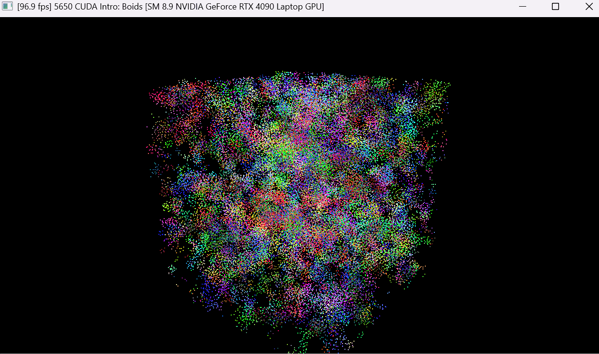

**University of Pennsylvania, CIS 5650: GPU Programming and Architecture,
Project 1 - Flocking**

* Christopher Yuen
  * [LinkedIn](https://www.linkedin.com/in/christopher-yuen-16b5a8221/)
* Tested on: Windows 11, 14th Gen Intel(R) Core(TM) i9-14900HX @ 2.22GHz 32GB, RTX 4090 Laptop GPU 16GB (Personal Laptop)

## Boids Simulation

50,000 boids, coherent uniform grid simulation.  
This is a CUDA Flocking project based on [Conard Parker's notes](http://www.vergenet.net/~conrad/boids/pseudocode.html) with slight adaptations. The aim of my implementation is to have bird-like object (boids) move around in a simulation space according to 3 rules: 
1) <ins>Cohesion</ins> - boids move towards the perceived center of mass of their neighbors
2) <ins>Separation</ins> - boids avoid getting too close to their neighbors
3) <ins>Alignment</ins> - boids generally move in the same direction and speed as their neighbors 

Here we have 3 different implementations that become increasingly more optimized for the GPU:
### 1) Naive Implementation
In the Naive implementation, every boid check every other boid to compute according to the 3 flocking rules. This is the straightforward approach where each boid iterates over all N boids and thus is in O(N^2)

### 2) Scattered Uniform Grid Implementation
To avoid the O(N^2) cost, here we divide the simulation space into a 3D grid of uniform cells. Each boid is assigned to its corresponding cell and we sort this list of boid indices with Thrust's `sort_by_key`. After this sort, all boids in the same cell are contiguous in the sorted index list, allowing each boid to check only its neighboring cells (8 cells) for potential neighbors. However, we leave the actual position and velocity data (`dev_pos`, `dev_vel1`) in their original, unsorted order which means the kernel must follow an indirection (`particleArrayIndices[j]`) to fetch a neighbor's data, resulting in scattered memory accesses.

### 3) Coherent Uniform Grid Implementation
Building upon the scatter grid, we add in an extra reordering step. Hence, after sorting the boid, the position and velocity buffers are physically rearranged so that all boids in the cell become continguous in memory. Therefore we remove the need for the indirection array (`particleArrayIndices[j]`) and thus when a warp loops over the boids in a cell, they access consecutive memory address making it a single memory transaction. This will drastically improve memory bandwidth and yield the best performance out of the 3 different implementations.

## Performance Analysis
### <ins># of Boids Impact</ins>
Increasing the # of boids generally decreases framerate for all implementations as more work needs to be done per frame. However, the implementations differ in their FPS rate of decline. Naive falls off way faster than scattered which falls off a bit faster than coherent.

FPS measurements are taken in Release x64 mode on a NVIDIA GeForce RTX 4090 Laptop GPU, with V-Sync off.  

| # of Boids | Naive | Scattered Grid | Coherent Grid |
| :--- | :--- | :--- | :--- |
| 8000 | 475.60 | 890.58 | 684.23 |
| 32000 | 128.49 | 776.82 | 854.61 |
| 128000 | 11.53 | 356.15 | 579.45 |
| 512000 | 0.76 | 68.42 | 367.42 |

 

| # of Boids | Naive | Scattered Grid | Coherent Grid |
| :--- | :--- | :--- | :--- |
| 8000 | 585.64 | 1467.56 | 1648.12 |
| 32000 | 134.35 | 1453.67 | 1578.65 |
| 128000 | 12.95 | 398.67 | 920.15 |
| 512000 | 0.84 | 69.51 | 414.68 |

   

### <ins>Block Count/Size Impact</ins>
Doubling the block size did not seem to change the framerate for any of the implementations. This seems to stem from the fact that the boid simulation relies more so on memory rather than compute.

FPS measurements are taken in Release x64 mode on a NVIDIA GeForce RTX 4090 Laptop GPU, with V-Sync off. I also set # of boids to 128,000.  

| Block Size | Naive | Scatter Grid | Coherent Grid |
| :--- | :--- | :--- | :--- |
| 128 | 12.13 | 369.42 | 681.65 |
| 256 | 14.64 | 384.98 | 659.11 |
| 512 | 11.43 | 398.57 | 664.24 |
| 1024 | 11.89 | 419.65 | 642.73 |

   

###  <ins>Coherent Uniform Grid Improvements</ins>
The more coherent uniform grid did have a strong impact on maintaining higher performance. This outcome was expected as we remove indirection and random global memory reads which improves effective memory bandwidth. 

 

### <ins>27 vs 8 Neighboring Cells Impact</ins>
Performance was minimally lowered when checking 27 neighboring cells instead of 8. Although at first one might suspect that 27 cell checks should be much slower than 8, each cell contains less boids on average and thus the total # of boids checked per particle remains approximately the same. 

